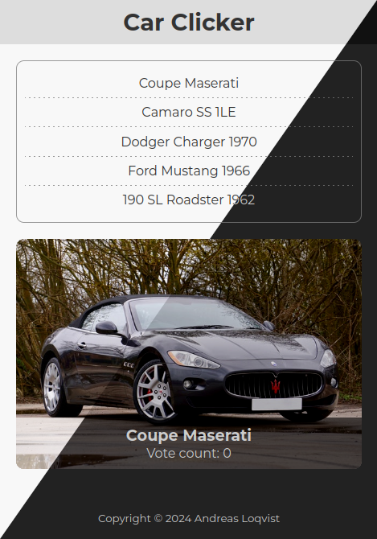

# Car Clicker

My version of Car Clicker, coded by RafaelDavisH. What made me interested in his project was that he chose to structure his code according to the MVC pattern. I have taken the concept further and made some changes to the code to make it a little more consistent. Created a completely new design and made the app support light and dark themes depending on the operating system setting. Further, I made some progressive enhancements like making it installable and executable offline.
